# Main Request Routing Flow

This diagram shows how incoming WordPress requests are routed to different endpoint handlers.

```mermaid
graph TD
    A["🚀 WordPress Request<br/>kismet-ask-proxy.php"] --> B{{"Check Request URL"}}

    B --> C["/.well-known/ai-plugin.json"]
    B --> D["/.well-known/mcp/servers.json"]
    B --> E["/robots.txt"]
    B --> F["/ask"]
    B --> G["/llms.txt"]
    B --> H["Other URL<br/>(Skip Plugin)"]

    C --> C1["🤖 AI Plugin Handler<br/>class-ai-plugin-handler.php"]
    D --> D1["🔧 MCP Servers Handler<br/>class-mcp-servers-handler.php"]
    E --> E1["🤖 Robots Handler<br/>class-robots-handler.php"]
    F --> F1["💬 Ask Handler<br/>class-ask-handler.php"]
    G --> G1["📝 LLMS.txt Handler<br/>class-llms-txt-handler.php"]
    H --> H1["❌ No Plugin Processing"]

    style A fill:#e1f5fe
    style C1 fill:#ffebee
    style D1 fill:#f3e5f5
    style E1 fill:#e8f5e8
    style F1 fill:#fff3e0
    style G1 fill:#fce4ec
```

## Key Files:

- **Main Plugin**: `kismet-ask-proxy.php`
- **AI Plugin**: `includes/endpoints/ai-plugin-json/class-ai-plugin-handler.php`
- **MCP Servers**: `includes/endpoints/mcp-servers-json/class-mcp-servers-handler.php`
- **Robots**: `includes/endpoints/robots-txt/class-robots-handler.php`
- **Ask**: `includes/endpoints/ask/class-ask-handler.php`
- **LLMS.txt**: `includes/endpoints/llms-txt/class-llms-txt-handler.php`

## Critical Issue:

The most frequently hit endpoint causing 429 errors is likely `/.well-known/ai-plugin.json` since AI crawlers check this constantly.
