# AI Plugin Handler Decision Flow

This shows the detailed decision making process for the AI Plugin endpoint that's causing 429 errors.

```mermaid
graph TD
    A["🤖 AI Plugin Request<br/>/.well-known/ai-plugin.json"] --> B["class-ai-plugin-handler.php<br/>Constructor"]

    B --> C["🎣 WordPress Hooks Registration"]
    C --> C1["init hook"]
    C --> C2["template_redirect hook"]
    C --> C3["query_vars hook"]

    C1 --> D["generate_static_file_if_needed()"]
    C2 --> E["intercept_ai_plugin_request()"]

    D --> D1{{"Static file exists?"}}
    D1 -->|No| D2["💾 DB CALLS START<br/>get_option() x15+"]
    D1 -->|Yes| D3{{"Content changed?"}}
    D3 -->|Yes| D2
    D3 -->|No| D4["✅ Skip generation"]

    D2 --> D5["💾 get_option('hotel_name')"]
    D2 --> D6["💾 get_option('hotel_description')"]
    D2 --> D7["💾 get_option('contact_email')"]
    D2 --> D8["💾 get_option('logo_url')"]
    D2 --> D9["💾 More get_option() calls..."]

    D5 --> D10["📝 Generate JSON content"]
    D6 --> D10
    D7 --> D10
    D8 --> D10
    D9 --> D10

    D10 --> D11["💾 File Safety Manager<br/>class-file-safety-manager.php"]
    D11 --> D12["📁 Write static file"]

    E --> E1{{"Is ai-plugin.json request?"}}
    E1 -->|Yes| E2{{"Static file exists?"}}
    E1 -->|No| E3["❌ Continue WordPress"]

    E2 -->|Yes| E4["🚀 Serve static file<br/>ZERO DB CALLS"]
    E2 -->|No| E5["💥 FALLBACK TO DYNAMIC<br/>💾 DB CALLS x15+"]

    style A fill:#ffebee
    style D2 fill:#ff5252,color:#fff
    style D5 fill:#ff5252,color:#fff
    style D6 fill:#ff5252,color:#fff
    style D7 fill:#ff5252,color:#fff
    style D8 fill:#ff5252,color:#fff
    style D9 fill:#ff5252,color:#fff
    style E5 fill:#ff5252,color:#fff
    style E4 fill:#4caf50,color:#fff
```

## 🚨 CRITICAL PROBLEM IDENTIFIED:

### Multiple Database Call Points:

1. **init hook**: Runs on EVERY page load, triggers static file generation check
2. **template_redirect hook**: Runs on EVERY request, checks for AI plugin requests
3. **Fallback Dynamic Serving**: If static file fails, triggers 15+ database calls

### Files Involved:

- `includes/endpoints/ai-plugin-json/class-ai-plugin-handler.php`
- `includes/shared/class-file-safety-manager.php`

### The 429 Issue Source:

- **init hook runs on every WordPress page load** → Database calls to check if static file needs regeneration
- **AI crawlers hit endpoint frequently** → Triggers both init AND template_redirect
- **Multiple hooks = Multiple database call opportunities per request**
