# All Handlers Hook Registration Comparison

This flowchart compares how each handler registers WordPress hooks and their potential for causing database load.

```mermaid
graph TD
    A["🔍 ALL HANDLERS PATTERN"] --> B["Constructor Hook Registration"]

    B --> B1["🤖 AI Plugin Handler<br/>class-ai-plugin-handler.php"]
    B --> B2["🔧 MCP Servers Handler<br/>class-mcp-servers-handler.php"]
    B --> B3["🤖 Robots Handler<br/>class-robots-handler.php"]
    B --> B4["📝 LLMS Handler<br/>class-llms-txt-handler.php"]
    B --> B5["💬 Ask Handler<br/>class-ask-handler.php"]

    B1 --> C1["❌ PROBLEMATIC HOOKS"]
    C1 --> C1a["init: generate_static_file_if_needed()"]
    C1 --> C1b["template_redirect: intercept_ai_plugin_request()"]
    C1 --> C1c["query_vars: add_query_vars()"]
    C1a --> D1["💾 15+ get_option() DB calls"]
    C1b --> D1

    B2 --> C2["⚠️ MODERATE HOOKS"]
    C2 --> C2a["init: safe_endpoint_creation()"]
    C2 --> C2b["parse_request: intercept_mcp_servers_request()"]
    C2 --> C2c["template_redirect: handle_mcp_servers_request()"]
    C2a --> D2["💾 Some get_option() calls"]

    B3 --> C3["⚠️ MODERATE HOOKS"]
    C3 --> C3a["init: safe_robots_enhancement()"]
    C3 --> C3b["robots_txt filter (conditional)"]
    C3a --> D3["💾 Some get_option() calls"]

    B4 --> C4["⚠️ MODERATE HOOKS"]
    C4 --> C4a["init: safe_endpoint_creation()"]
    C4 --> C4b["template_redirect: handle_llms_request()"]
    C4a --> D4["💾 Some get_option() calls"]

    B5 --> C5["✅ SAFER HOOKS"]
    C5 --> C5a["template_redirect: handle_ask_request()"]
    C5a --> D5["💾 Minimal DB calls"]

    style C1 fill:#ff5252,color:#fff
    style C1a fill:#ff5252,color:#fff
    style C1b fill:#ff5252,color:#fff
    style C1c fill:#ff5252,color:#fff
    style D1 fill:#ff5252,color:#fff
    style C2 fill:#ffab00,color:#fff
    style C3 fill:#ffab00,color:#fff
    style C4 fill:#ffab00,color:#fff
    style C5 fill:#4caf50,color:#fff
```



## 🚨 CRITICAL FINDINGS:

### 1. **AI Plugin Handler is the WORST OFFENDER**

- **Multiple hooks per request**: `init` + `template_redirect` + `query_vars`
- **Runs on EVERY page load**: `init` hook triggers database calls site-wide
- **Heavy database load**: 15+ `get_option()` calls per request
- **File**: `includes/endpoints/ai-plugin-json/class-ai-plugin-handler.php`

### 2. **Other Handlers Follow Similar Problematic Pattern**

- **All use `init` hook**: Triggers on every WordPress page load
- **File operations on every init**: Checking files, testing routes, etc.
- **Multiple interception points**: Both `parse_request` and `template_redirect`

### 3. **The 429 Root Cause Pattern**

```
Every WordPress Page Load:
├── AI Plugin Handler: init → 15+ DB calls
├── MCP Servers Handler: init → route testing + some DB calls
├── Robots Handler: init → route testing + some DB calls
├── LLMS Handler: init → route testing + some DB calls
└── Ask Handler: only template_redirect (SAFEST)
```

### 4. **Multiplication Effect**

- **1 AI discovery request** = Multiple handlers × Multiple hooks × Multiple DB calls
- **AI crawlers hit frequently** = Exponential database load
- **Result**: 429 rate limiting from database overload
