# 429 Error Root Cause & Solution Strategy

This flowchart identifies the exact cause of the 429 errors and provides the fix strategy.

```mermaid
graph TD
    A["🚨 429 ERROR ROOT CAUSE IDENTIFIED"] --> B["❌ PROBLEM: init HOOK ABUSE"]

    B --> C["Current Bad Pattern"]
    C --> C1["🤖 AI Plugin: init hook"]
    C --> C2["🔧 MCP Servers: init hook"]
    C --> C3["🤖 Robots: init hook"]
    C --> C4["📝 LLMS: init hook"]

    C1 --> D["💾 EVERY WordPress Page Load<br/>= 15+ DB calls × 4 handlers<br/>= 60+ DB calls per page"]
    C2 --> D
    C3 --> D
    C4 --> D

    D --> E["AI Crawlers + High Traffic<br/>= Database Overload<br/>= 429 Rate Limiting"]

    A --> F["✅ SOLUTION STRATEGY"]
    F --> G["🎯 Target: ELIMINATE init hooks"]

    G --> H["New Safe Pattern"]
    H --> H1["Only hook on ACTUAL endpoint requests"]
    H --> H2["No init hooks = No site-wide DB load"]
    H --> H3["Use request-specific detection"]

    H1 --> I["Implementation Plan"]
    I --> I1["1. Remove ALL init hooks"]
    I --> I2["2. Use template_redirect ONLY"]
    I --> I3["3. Check request URL first"]
    I --> I4["4. Skip processing if not target endpoint"]

    style B fill:#ff5252,color:#fff
    style C1 fill:#ff5252,color:#fff
    style C2 fill:#ff5252,color:#fff
    style C3 fill:#ff5252,color:#fff
    style C4 fill:#ff5252,color:#fff
    style D fill:#ff5252,color:#fff
    style E fill:#ff5252,color:#fff
    style G fill:#4caf50,color:#fff
    style H1 fill:#4caf50,color:#fff
    style H2 fill:#4caf50,color:#fff
    style H3 fill:#4caf50,color:#fff
```



## 🎯 **THE SMOKING GUN DISCOVERED!**

### **Root Cause: `init` Hook Abuse**

Every handler was using WordPress `init` hook, which triggers on **EVERY page load**, not just endpoint requests.

**Current Disaster Math:**

```
Every WordPress Page Load:
├── AI Plugin Handler: 15+ get_option() calls
├── MCP Servers Handler: 5+ get_option() calls
├── Robots Handler: 3+ get_option() calls
├── LLMS Handler: 5+ get_option() calls
└── TOTAL: ~30+ database calls PER PAGE LOAD
```

**With AI Crawlers:**

- ChatGPT discovers site → hits homepage → 30+ DB calls
- Claude discovers site → hits homepage → 30+ DB calls
- Multiple discovery endpoints → More homepage visits
- High traffic site → Multiplied database load
- **Result: Database overload → 429 rate limiting**

### **Fix Strategy: Request-Specific Processing**

**Before (BAD):**

```php
// EVERY page load triggers this
add_action('init', 'do_expensive_database_calls');
```

**After (GOOD):**

```php
// ONLY endpoint requests trigger this
add_action('template_redirect', function() {
    if ($_SERVER['REQUEST_URI'] !== '/target-endpoint') return;
    // Only process when actually needed
});
```

### **Files That Need Fixing:**

1. `includes/endpoints/ai-plugin-json/class-ai-plugin-handler.php` (CRITICAL)
2. `includes/endpoints/mcp-servers-json/class-mcp-servers-handler.php`
3. `includes/endpoints/robots-txt/class-robots-handler.php`
4. `includes/endpoints/llms-txt/class-llms-txt-handler.php`

**Result:** 30+ DB calls per page → 0 DB calls per page (except actual endpoint requests)
