# WordPress Plugin Lifecycle & Rewrite Rules

This flowchart shows the WordPress plugin lifecycle and when rewrite rules are actually registered.

```mermaid
graph TD
    A["🔄 WordPress Plugin Lifecycle"] --> B["Plugin Installation"]

    B --> B1["1. Files Copied to /wp-content/plugins/"]
    B1 --> B2["2. Plugin NOT Active Yet"]
    B2 --> B3["3. No Hooks Registered"]
    B3 --> B4["4. No Rewrite Rules Added"]

    B --> C["Plugin Activation"]
    C --> C1["register_activation_hook()"]
    C1 --> C2["Plugin Constructor Runs"]
    C2 --> C3["WordPress Hooks Registered"]
    C3 --> C3a["init hooks"]
    C3 --> C3b["template_redirect hooks"]
    C3 --> C3c["query_vars hooks"]

    C3 --> C4["Rewrite Rules Registration"]
    C4 --> C4a["add_rewrite_rule() calls"]
    C4 --> C4b["flush_rewrite_rules()"]
    C4b --> C5["💾 WordPress Database<br/>.htaccess Updated"]

    C --> D["Plugin Deactivation"]
    D --> D1["register_deactivation_hook()"]
    D1 --> D2["Rewrite Rules Removal"]
    D2 --> D3["flush_rewrite_rules()"]
    D3 --> D4["💾 WordPress Database<br/>.htaccess Cleaned"]

    style B fill:#e3f2fd
    style C fill:#fff3e0
    style D fill:#ffebee
    style C5 fill:#ff5252,color:#fff
    style D4 fill:#4caf50,color:#fff
```

## 🔍 Critical Questions for 429 Debugging:

### 1. **Are Rewrite Rules Actually Being Registered?**

- Do our handlers call `add_rewrite_rule()` during activation?
- Is `flush_rewrite_rules()` being called?
- Are rules being written to WordPress database + .htaccess?

### 2. **When Do Handlers Actually Run?**

- **Plugin Activation**: Constructors run, hooks registered
- **Every Request**: Only registered hooks trigger
- **Plugin Deactivation**: Hooks unregistered, rules flushed

### 3. **The Real Question:**

**Are AI crawler requests being intercepted by WordPress rewrite rules OR served directly by Apache/nginx?**

### Files to Examine:

- Look for `add_rewrite_rule()` calls
- Look for `flush_rewrite_rules()` calls
- Check activation/deactivation hooks
- Examine actual .htaccess file after activation
