# Real Request Routing: Web Server vs WordPress

This flowchart shows the **actual path** of AI crawler requests and whether they hit WordPress or not.

```mermaid
graph TD
    A["🌐 AI Crawler Request<br/>GET /.well-known/ai-plugin.json"] --> B["Apache/Nginx Web Server"]

    B --> C{{"Check Static File<br/>public_html/.well-known/ai-plugin.json"}}

    C -->|"File Exists<br/>+ No .htaccess Rules"| D["✅ DIRECT SERVE<br/>0 DB calls<br/>0 PHP execution"]

    C -->|"File Exists<br/>+ .htaccess WordPress Rules"| E["⚠️ WordPress Intercept<br/>.htaccess redirect to index.php"]

    C -->|"File Missing"| F["❌ 404 or WordPress Fallback"]

    E --> G["WordPress index.php Loads"]
    G --> H["WordPress Query Parsing"]
    H --> I["Check Rewrite Rules Database"]

    I --> J{{"Match: /.well-known/ai-plugin.json"}}
    J -->|"Rule Found"| K["🔥 PLUGIN HANDLER TRIGGERS<br/>class-ai-plugin-handler.php"]
    J -->|"No Rule"| L["Regular WordPress Routing"]

    K --> M["template_redirect Hook Fires"]
    M --> N["intercept_ai_plugin_request()"]
    N --> O["💾 15+ get_option() DB Calls"]
    O --> P["Generate JSON Response"]

    style D fill:#4caf50,color:#fff
    style K fill:#ff5252,color:#fff
    style O fill:#ff5252,color:#fff
    style E fill:#ff9800,color:#fff
```



## 🚨 **THE KEY DEBUGGING QUESTIONS:**

### 1. **What's in .htaccess after plugin activation?**

```bash
# Check if WordPress rules are intercepting our static files
ssh server 'cat public_html/.htaccess | grep -A5 -B5 "well-known"'
```

### 2. **Are rewrite rules being registered?**

```bash
# Check WordPress rewrite rules database
ssh server 'cd public_html && wp rewrite list | grep "well-known"'
```

### 3. **Is the static file being ignored?**

- **Path A (GOOD)**: Static file served directly by Apache/nginx
- **Path B (BAD)**: WordPress intercepts and triggers plugin handlers
- **Path C (EXPECTED)**: File missing = 404

### 4. **The 429 Error Sources:**

- If requests go through **Path B**: Every AI crawler hit = 15+ DB calls
- High-frequency AI crawlers × Multiple endpoints = Database overload
- Rate limiting kicks in = 429 errors

## 🔍 Investigation Steps:

1. Examine .htaccess file after plugin activation
2. Check WordPress rewrite rules database
3. Test request path with curl -I and server logs
4. Determine if static files are being served or intercepted
