# Clear Decision Flow: Yes/No Questions

This flowchart shows the exact decision points for debugging the 429 errors.

```mermaid
graph TD
    A["🌐 Request: /.well-known/ai-plugin.json"] --> B{"Does static file exist?<br/>public_html/.well-known/ai-plugin.json"}

    B -->|YES| C{"Are WordPress rewrite rules<br/>in .htaccess intercepting?"}
    B -->|NO| D["❌ 404 Error<br/>(Expected when plugin inactive)"]

    C -->|NO| E["✅ PERFECT<br/>Apache serves static file directly<br/>Zero PHP execution<br/>Zero database calls"]

    C -->|YES| F["⚠️ PROBLEM<br/>WordPress intercepts request<br/>Loads index.php"]

    F --> G{"Does WordPress find<br/>matching rewrite rule?"}

    G -->|YES| H["🔥 DISASTER<br/>Plugin handler executes<br/>15+ database calls<br/>Rate limiting = 429 errors"]

    G -->|NO| I["WordPress 404<br/>(Static file ignored)"]

    style E fill:#4caf50,color:#fff
    style H fill:#ff5252,color:#fff
    style F fill:#ff9800,color:#fff
    style D fill:#9e9e9e,color:#fff
```



## 🔍 **Debugging Commands for Each Decision Point:**

### Question 1: "Does static file exist?"

```bash
ssh server 'ls -la public_html/.well-known/ai-plugin.json'
```

- **YES**: File exists with recent timestamp
- **NO**: File missing (plugin not generating it)

### Question 2: "Are WordPress rewrite rules in .htaccess intercepting?"

```bash
ssh server 'cat public_html/.htaccess'
```

Look for:

- **YES**: Lines containing `RewriteRule` and `index.php`
- **NO**: Clean .htaccess or no WordPress rules

### Question 3: "Does WordPress find matching rewrite rule?"

```bash
ssh server 'cd public_html && wp rewrite list | grep well-known'
```

- **YES**: Shows rewrite rule for `well-known/ai-plugin.json`
- **NO**: No matching rule found

## 🎯 **Expected Results:**

- **GOOD FLOW**: Question 1=YES, Question 2=NO → Static file served directly
- **BAD FLOW**: Question 1=YES, Question 2=YES, Question 3=YES → 429 errors

## 🚨 **What We Need to Test:**

1. Install plugin
2. Run the 3 debugging commands above
3. See which path the requests actually take
