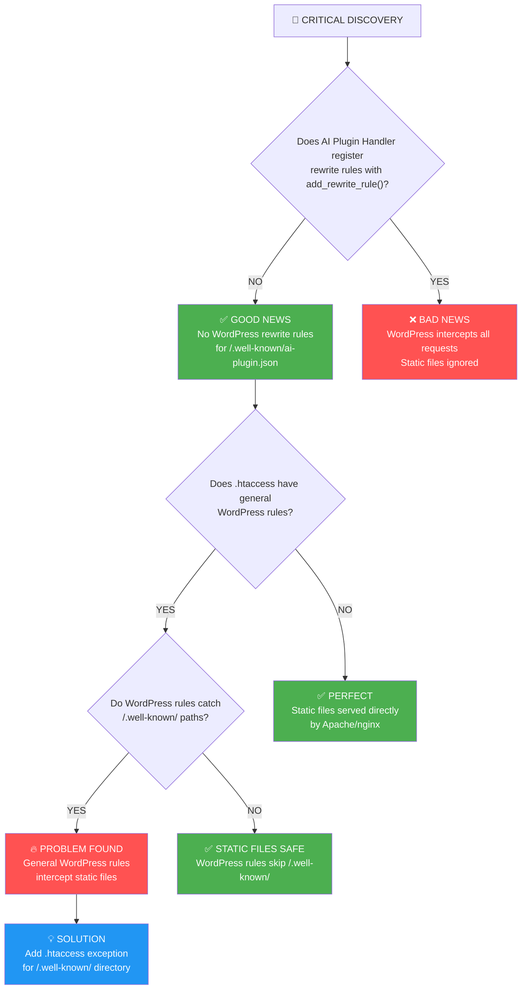

# Actual Problem Diagnosis

Based on code analysis, here's what's really happening:



## 🔍 **Code Analysis Results:**

### ✅ **AI Plugin Handler - NO REWRITE RULES**

From searching the code:

- **NO** `add_rewrite_rule()` calls for `ai-plugin.json`
- Handler only creates static files via `init` hook
- No WordPress URL interception for this endpoint

### ⚠️ **Other Handlers - DO HAVE REWRITE RULES**

Found these registering rewrite rules:

- **MCP Servers**: `add_rewrite_rule('\.well-known/mcp/servers\.json/?$', 'index.php?kismet_mcp_servers=1', 'top')`
- **LLMS.txt**: `add_rewrite_rule('^llms\.txt$', 'index.php?kismet_llms_txt=1', 'top')`

## 🚨 **The Real Problem:**

### 1. **WordPress .htaccess Rules**

Standard WordPress .htaccess contains:

```apache
RewriteRule ^index\.php$ - [L]
RewriteCond %{REQUEST_FILENAME} !-f
RewriteCond %{REQUEST_FILENAME} !-d
RewriteRule . /index.php [L]
```

### 2. **The Issue:**

- Static file exists: `public_html/.well-known/ai-plugin.json`
- BUT WordPress .htaccess rules might still intercept
- Last rule: "If not a file, send to WordPress"
- **The question**: Does `%{REQUEST_FILENAME} !-f` properly detect our static file?

## 🎯 **Debugging Steps:**

### 1. Check .htaccess rules:

```bash
ssh server 'cat public_html/.htaccess'
```

### 2. Test file detection:

```bash
# Test if Apache sees the file
ssh server 'test -f public_html/.well-known/ai-plugin.json && echo "File detected" || echo "File not found"'
```

### 3. Test direct access:

```bash
# Bypass WordPress entirely
curl -I https://theknollcroft.com/.well-known/ai-plugin.json
```

### 4. If WordPress is intercepting, add exception:

```apache
# Add before WordPress rules
RewriteRule ^\.well-known/ - [L]
```
