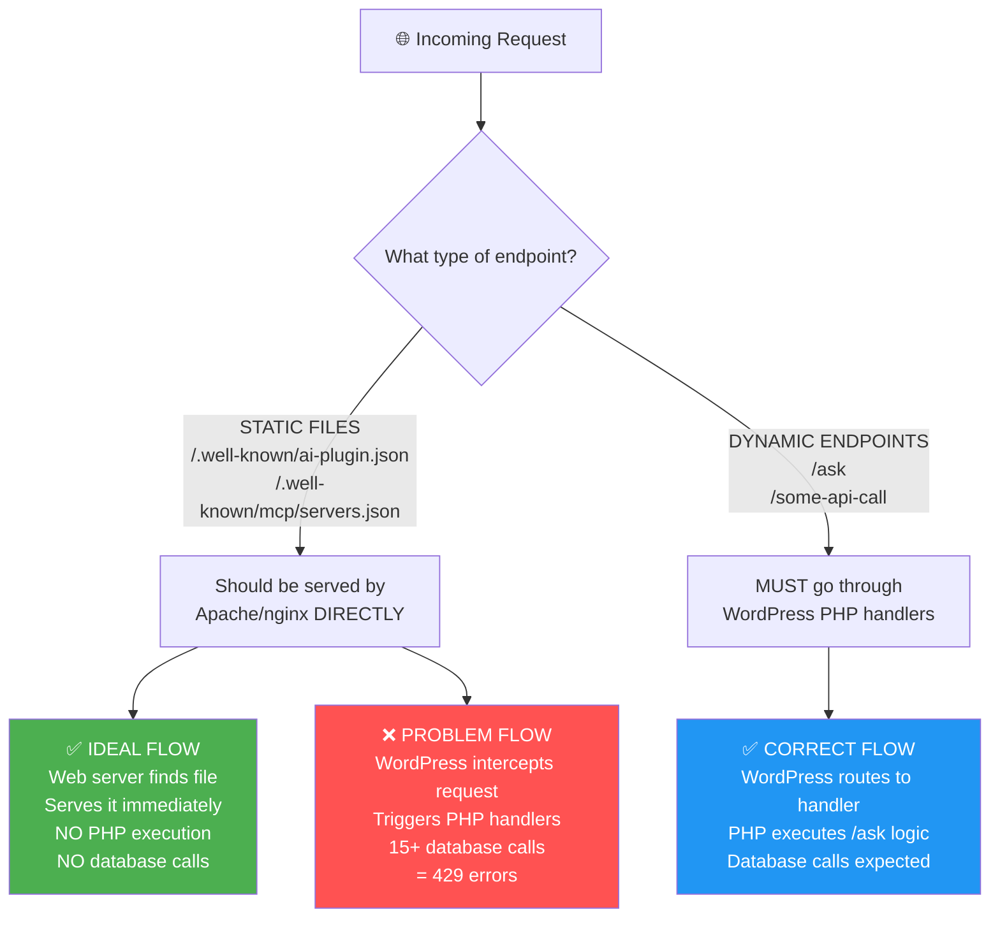

# Static Files vs Dynamic Endpoints - The Key Difference

This explains why some endpoints cause 429 errors and others don't.



## 🔍 **The Fundamental Difference:**

### 📄 **STATIC FILES** (Should bypass WordPress)

- `/.well-known/ai-plugin.json` - AI plugin discovery file
- `/.well-known/mcp/servers.json` - MCP servers list
- `/robots.txt` - Robot instructions
- `/llms.txt` - LLM instructions

**How they SHOULD work:**

1. File exists on disk: `public_html/.well-known/ai-plugin.json`
2. Apache/nginx finds file and serves it directly
3. **Zero PHP execution, zero database calls**

### 🚀 **DYNAMIC ENDPOINTS** (Must use WordPress)

- `/ask` - Chat/query processing
- `/wp-admin` - WordPress admin
- Any custom API endpoints

**How they MUST work:**

1. No physical file exists
2. WordPress routing captures request
3. PHP handlers execute business logic
4. Database calls are normal and expected

## 🚨 **The 429 Error Problem:**

### ❌ **What's Going Wrong:**

Static files are being **intercepted by WordPress** instead of served directly:

```
REQUEST: /.well-known/ai-plugin.json
├── Apache checks: File exists? YES
├── Apache checks: .htaccess rules?
│   └── WordPress rule: "Send to index.php"
├── WordPress loads and processes request
├── Plugin handlers trigger via init/template_redirect hooks
├── 15+ database calls execute
└── High-frequency AI crawlers = database overload = 429 errors
```

### ✅ **What Should Happen:**

```
REQUEST: /.well-known/ai-plugin.json
├── Apache checks: File exists? YES
├── Apache serves file directly
└── Done. Zero PHP, zero database calls.
```

## 🎯 **The Questions We Need to Answer:**

1. **Are static files actually being created?**
2. **Is WordPress intercepting static file requests?**
3. **Why is WordPress routing being triggered for files that exist?**

## 🔧 **WordPress Rewrite Rules vs .htaccess:**

- **WordPress Rewrite Rules**: PHP code (`add_rewrite_rule()`) that tells WordPress how to route URLs
- **.htaccess**: Apache configuration that controls web server behavior
- **The Connection**: WordPress rewrite rules can modify .htaccess to redirect requests to WordPress

**The problem**: If WordPress writes rules to .htaccess that intercept our static files, they get processed by PHP instead of served directly.
