# Simple 3-Step Debugging Process

This shows exactly how to determine if static files are being served or intercepted.

```mermaid
graph TD
    A["🔧 DEBUGGING STEPS"] --> B["1. Check if static files exist"]

    B --> B1["ssh server 'ls -la public_html/.well-known/'"]
    B1 --> B2{"Files exist?"}

    B2 -->|NO| C["❌ Plugin not creating files<br/>Fix: Check plugin generation logic"]
    B2 -->|YES| D["2. Check .htaccess rules"]

    D --> D1["ssh server 'cat public_html/.htaccess'"]
    D1 --> D2{"WordPress rules present?"}

    D2 -->|NO| E["✅ Should work perfectly<br/>Apache serves files directly"]
    D2 -->|YES| F["3. Test if WordPress intercepts"]

    F --> F1["curl -v https://site/.well-known/ai-plugin.json"]
    F1 --> F2{"Response headers show?"}

    F2 -->|"Content-Type: application/json<br/>Server: Apache"| G["✅ Static file served directly<br/>NO 429 errors"]

    F2 -->|"X-Powered-By: PHP<br/>WordPress headers"| H["🔥 PROBLEM FOUND<br/>WordPress intercepting<br/>= 429 errors"]

    H --> I["💡 SOLUTION<br/>Add .htaccess exception:<br/>RewriteRule ^\.well-known/ - [L]"]

    style C fill:#ff5252,color:#fff
    style E fill:#4caf50,color:#fff
    style G fill:#4caf50,color:#fff
    style H fill:#ff5252,color:#fff
    style I fill:#2196f3,color:#fff
```



## 🔍 **How to Identify the Problem:**

### Step 1: Check File Existence

```bash
ssh server 'ls -la public_html/.well-known/'
```

**Expected**: Files with recent timestamps

### Step 2: Check .htaccess

```bash
ssh server 'cat public_html/.htaccess'
```

**Look for**: WordPress rewrite rules like:

```apache
RewriteRule . /index.php [L]
```

### Step 3: Test Response Headers

```bash
curl -v https://theknollcroft.com/.well-known/ai-plugin.json
```

**GOOD Response** (Static file served):

```
HTTP/1.1 200 OK
Content-Type: application/json
Server: Apache/2.4.x
```

**BAD Response** (WordPress intercept):

```
HTTP/1.1 200 OK
X-Powered-By: PHP/8.x
Set-Cookie: wordpress_...
```

## 🚨 **The Key Insight:**

If you see **ANY PHP headers** in the response to static file requests, that means:

1. WordPress is intercepting the request
2. PHP is executing
3. Database calls are happening
4. High frequency = 429 errors

**The fix**: Add `.htaccess` exception to let Apache serve static files directly.
