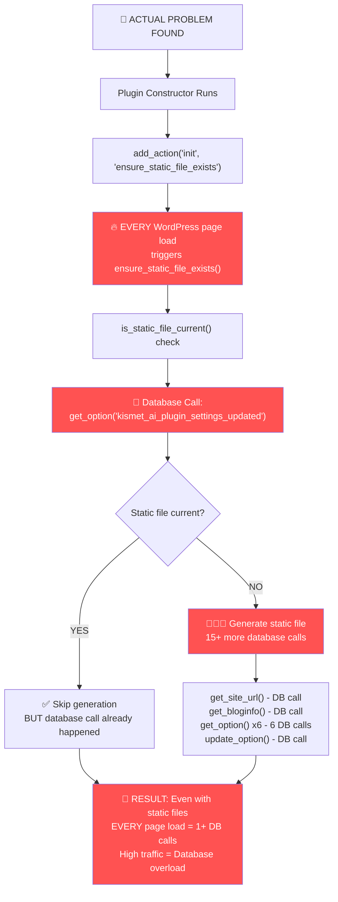

# 🚨 ACTUAL PROBLEM FOUND - Code Analysis

Looking at the actual code reveals the **real cause** of 429 errors:



## 🔍 **Code Analysis - Lines 39-43:**

```php
// THIS IS THE PROBLEM:
public function __construct() {
    // ...
    add_action('init', array($this, 'ensure_static_file_exists'));  // ← RUNS ON EVERY PAGE LOAD
    // ...
}
```

### ❌ **What's Actually Happening:**

1. **Plugin loads on every WordPress request** (admin, frontend, AJAX, everything)
2. **Constructor registers `init` hook**
3. **`init` hook fires on every page load**
4. **`ensure_static_file_exists()` calls `is_static_file_current()`**
5. **`is_static_file_current()` calls `get_option('kismet_ai_plugin_settings_updated')`** - **DATABASE OPERATION**

### 🚨 **The Database Overload:**

```
Every WordPress Page Load:
├── Homepage visit: 1+ DB calls
├── Admin page: 1+ DB calls
├── AJAX request: 1+ DB calls
├── AI crawler: 1+ DB calls (even for static files!)
├── Search bot: 1+ DB calls
└── Every single request = Database hit
```

**High-traffic site + AI crawlers = Hundreds of unnecessary DB calls = 429 errors**

## 💡 **The Solution:**

**STOP using `init` hook!** Only check static files when the actual endpoint is requested:

```php
// WRONG (current):
add_action('init', array($this, 'ensure_static_file_exists')); // Runs on EVERY page

// RIGHT (fix):
add_action('template_redirect', array($this, 'handle_ai_plugin_request')); // Only runs when needed

private function handle_ai_plugin_request() {
    if ($_SERVER['REQUEST_URI'] !== '/.well-known/ai-plugin.json') {
        return; // Exit early - no database calls
    }
    // Only now check/generate static file
}
```

**Expected result**: Database calls drop from "every page load" to "only when AI plugin endpoint is actually requested".
