# 🚨 PLUGIN DISASTER REVEALED - ALL HANDLERS ABUSE init HOOKS

The code reveals the **FULL SCOPE** of the 429 error disaster:

```mermaid
graph TD
    A["🚨 PLUGIN DISASTER REVEALED"] --> B["5 HANDLERS × init HOOKS"]

    B --> C1["🤖 AI Plugin Handler<br/>init: ensure_static_file_exists()"]
    B --> C2["🔧 MCP Servers Handler<br/>init: safe_endpoint_creation()"]
    B --> C3["🤖 Robots Handler<br/>init: safe_robots_enhancement()"]
    B --> C4["📝 LLMS Handler<br/>init: safe_llms_creation()"]
    B --> C5["💬 Ask Handler<br/>init: handle_ask_requests()"]

    C1 --> D["💾 EVERY WordPress Page Load"]
    C2 --> D
    C3 --> D
    C4 --> D
    C5 --> D

    D --> E["All 5 handlers execute<br/>Database operations"]

    E --> F1["💾 get_option() calls"]
    E --> F2["💾 get_site_url() calls"]
    E --> F3["💾 get_bloginfo() calls"]
    E --> F4["💾 Route testing DB hits"]
    E --> F5["💾 File existence checks"]

    F1 --> G["🔥 RESULT:<br/>20+ database operations<br/>PER PAGE LOAD"]
    F2 --> G
    F3 --> G
    F4 --> G
    F5 --> G

    G --> H["High-traffic site + AI crawlers<br/>= HUNDREDS of unnecessary DB calls<br/>= Database overload<br/>= 429 RATE LIMITING"]

    style B fill:#ff5252,color:#fff
    style D fill:#ff5252,color:#fff
    style G fill:#ff5252,color:#fff
    style H fill:#ff5252,color:#fff
```



## 🔍 **Code Analysis - THE FULL SCOPE:**

### ❌ **Every Handler Abuses `init` Hook:**

```php
// AI Plugin Handler (Lines 39):
add_action('init', array($this, 'ensure_static_file_exists'));

// MCP Servers Handler (Line 40):
add_action('init', array($this, 'safe_endpoint_creation'));

// Robots Handler (Line 41):
add_action('init', array($this, 'safe_robots_enhancement'));

// LLMS Handler (Line 41):
add_action('init', array($this, 'safe_llms_creation'));

// Ask Handler (Line 14):
add_action('init', array($this, 'handle_ask_requests'));
```

### 🚨 **What Each Handler Does on EVERY Page Load:**

#### 1. **AI Plugin Handler** (`ensure_static_file_exists`):

- `get_option('kismet_ai_plugin_settings_updated')` - 1 DB call
- If regenerating: `get_site_url()`, `get_bloginfo()`, `get_option()` ×6 - 8+ DB calls

#### 2. **MCP Servers Handler** (`safe_endpoint_creation`):

- `$this->route_tester->is_route_active()` - HTTP requests + DB calls
- `file_exists()` checks
- `get_bloginfo()`, `get_site_url()`, `get_option()` calls - 3+ DB calls

#### 3. **Robots Handler** (`safe_robots_enhancement`):

- `$this->route_tester->is_route_active('/robots.txt')` - HTTP + DB calls
- `file_exists()` checks
- `get_site_url()`, `current_time()` - 2+ DB calls

#### 4. **LLMS Handler** (`safe_llms_creation`):

- Similar pattern: route testing + file checks + DB calls

#### 5. **Ask Handler** (`handle_ask_requests`):

- Route setup and testing + DB calls

### 💀 **The Math:**

```
Every WordPress Page Load:
├── Homepage: 20+ unnecessary DB calls
├── Admin page: 20+ unnecessary DB calls
├── AJAX request: 20+ unnecessary DB calls
├── AI crawler hit: 20+ unnecessary DB calls
├── Search bot: 20+ unnecessary DB calls
└── Every. Single. Request. = 20+ DB operations

High-traffic site = Thousands of unnecessary DB calls per minute
AI crawlers = Additional load
= DATABASE OVERLOAD = 429 ERRORS
```

## 💡 **The Nuclear Fix:**

**REMOVE ALL `init` HOOKS** and use request-specific processing:

```php
// WRONG (ALL current handlers):
add_action('init', $expensive_function); // Runs on EVERY page

// RIGHT (fix for ALL handlers):
add_action('template_redirect', $this->check_if_this_request_needs_me);

private function check_if_this_request_needs_me() {
    if ($_SERVER['REQUEST_URI'] !== '/my-specific-endpoint') {
        return; // Exit immediately - ZERO database calls
    }
    // Only now do the expensive setup
}
```

**Expected result**: Database calls drop from "20+ per page load" to "only when specific endpoints are actually requested".
