# 🎯 Clean Architecture Design - Split Installation vs Request Handling

This shows the new architecture that eliminates init hook abuse:

```mermaid
graph TD
    A["🔄 NEW CLEAN ARCHITECTURE"] --> B["Installation Logic"]
    A --> C["Request Handlers"]

    B --> B1["✅ ONLY runs during:<br/>Plugin Activation<br/>Plugin Deactivation"]
    B --> B2["🔧 Setup Tasks:<br/>Create static files<br/>Add rewrite rules<br/>Create directories<br/>Configure settings"]

    C --> C1["✅ ONLY runs when:<br/>Specific endpoint requested<br/>Zero init hooks"]
    C --> C2["🚀 Request Tasks:<br/>Serve content<br/>Process queries<br/>Handle API calls"]

    B1 --> D["class-[endpoint]-installer.php"]
    B2 --> D
    C1 --> E["class-[endpoint]-handler.php"]
    C2 --> E

    D --> F["register_activation_hook()<br/>register_deactivation_hook()"]
    E --> G["template_redirect hook<br/>ONLY if REQUEST_URI matches"]

    style B fill:#4caf50,color:#fff
    style C fill:#2196f3,color:#fff
    style D fill:#4caf50,color:#fff
    style E fill:#2196f3,color:#fff
```



## 📁 **New File Structure:**

### **Installation Logic (Runs Once)**

```
includes/installers/
├── class-ai-plugin-installer.php    - Sets up /.well-known/ai-plugin.json
├── class-mcp-servers-installer.php  - Sets up /.well-known/mcp/servers.json
├── class-robots-installer.php       - Sets up /robots.txt
├── class-llms-installer.php         - Sets up /llms.txt
└── class-ask-installer.php          - Sets up /ask endpoint
```

### **Request Handlers (Runs Only When Needed)**

```
includes/handlers/
├── class-ai-plugin-handler.php      - Handles /.well-known/ai-plugin.json requests
├── class-mcp-servers-handler.php    - Handles /.well-known/mcp/servers.json requests
├── class-robots-handler.php         - Handles /robots.txt requests
├── class-llms-handler.php           - Handles /llms.txt requests
└── class-ask-handler.php            - Handles /ask requests
```

## 🔧 **Installation Logic Pattern:**

```php
class Kismet_AI_Plugin_Installer {

    public static function activate() {
        // Run ONCE during plugin activation
        self::create_static_file();
        self::create_directories();
        // NO init hooks!
    }

    public static function deactivate() {
        // Run ONCE during plugin deactivation
        self::cleanup_files();
        self::flush_rewrite_rules();
    }

    private static function create_static_file() {
        // Generate static file ONE TIME
        // All the expensive get_option() calls happen HERE
        // Never again on page loads
    }
}

// In main plugin file:
register_activation_hook(__FILE__, array('Kismet_AI_Plugin_Installer', 'activate'));
register_deactivation_hook(__FILE__, array('Kismet_AI_Plugin_Installer', 'deactivate'));
```

## 🚀 **Request Handler Pattern:**

```php
class Kismet_AI_Plugin_Handler {

    public function __construct() {
        // ONLY register template_redirect - NO init hook!
        add_action('template_redirect', array($this, 'handle_request'));
    }

    public function handle_request() {
        // Exit immediately if not our endpoint
        if ($_SERVER['REQUEST_URI'] !== '/.well-known/ai-plugin.json') {
            return; // ZERO database operations
        }

        // Only now handle the request
        $this->serve_static_file();
    }

    private function serve_static_file() {
        // Serve pre-generated static file
        // NO database operations needed
    }
}
```

## ✅ **Expected Results:**

### Before (Current Disaster):

- **Every page load**: 20+ database operations
- **High traffic**: Thousands of unnecessary DB calls
- **Result**: Database overload = 429 errors

### After (Clean Architecture):

- **Regular page loads**: 0 database operations from plugin
- **Endpoint requests**: Only necessary operations when actually needed
- **Result**: Massive performance improvement, no 429 errors

## 🎯 **Implementation Plan:**

1. Create installer classes for one-time setup
2. Create lean handler classes for request-specific processing
3. Remove ALL init hooks
4. Test that endpoints work with zero page load overhead
